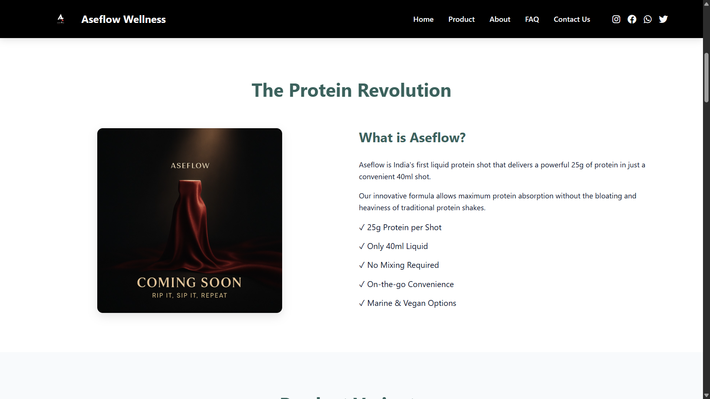

# Aseflow Website

A responsive website for Aseflow - India's First Liquid Protein Shot.

## Description

This website is built using HTML, CSS, and vanilla JavaScript. It showcases Aseflow, a liquid protein shot product that delivers 25g of protein in a convenient 40ml shot, available in both marine and vegan options.

## Features

- Responsive design for mobile, tablet, and desktop
- Interactive navigation with smooth scrolling
- Product information sections
- Order form with validation
- Query form for customer inquiries
- Social media links
- Newsletter subscription
- Clean, modern UI

## Tech Stack

- HTML5
- CSS3
- Vanilla JavaScript
- Font Awesome for icons
- Node.js (for local development server)

## Getting Started

### Prerequisites

- Node.js installed on your machine

### Installation

1. Clone the repository or download the files
2. Navigate to the project directory

```bash
cd basic-website
```

3. Start the local development server

```bash
node server.js
```

4. Open your browser and visit `http://localhost:3000`

## Project Structure

```
basic-website/
├── css/
│   └── styles.css
├── js/
│   └── script.js
├── index.html
├── server.js
├── favicon.svg
├── package.json
└── README.md
```

## Customization

- Update content in `index.html`
- Modify styles in `css/styles.css`
- Add functionality in `js/script.js`

## Deployment

This website can be deployed on any static web hosting service like:

- Netlify
- Vercel
- GitHub Pages
- AWS S3
- Firebase Hosting

## License

This project is licensed under the MIT License - see the LICENSE file for details.


## Website Preview





